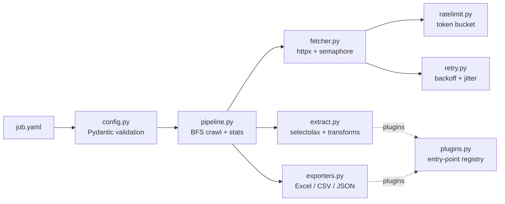

# Harvester

[](https://github.com/VertexSoftwareDev/harvester/actions/workflows/ci.yml)


**Declarative, async web scraping. Describe the data in YAML and get clean Excel, CSV or JSON back.**

```yaml
# examples/books.yaml
start_urls: [https://books.toscrape.com/catalogue/page-1.html]
item: article.product_pod
fields:
  title: h3 a @title
  price: p.price_color | price
  rating: p.star-rating @class | regex:star-rating (\w+) | lower
  url: h3 a @href | absolute_url
pagination:
  next: li.next a
  max_pages: 5
exports:
  - format: excel
```

```console
$ harvester run examples/books.yaml
Job 'books' finished
 Pages     5 ok, 0 failed
 Items     100 scraped, 0 skipped
 Elapsed   2.41s
 Output    output/books-2026-09-17.xlsx
 Output    output/books.csv
```

<!-- TODO: replace with a short demo GIF (e.g. recorded with vhs or asciinema) -->

## Why Harvester?

Most scraping scripts are copy-pasted one-offs: no retries, no rate limiting, and
nothing to reuse next time. Harvester separates **what** to extract (a small YAML
file) from **how** to fetch it well (a tested async engine):

- **Async and polite:** concurrent fetching with `httpx`, a token-bucket rate
  limiter, and retries with exponential backoff and jitter for timeouts, `429` and `5xx`.
- **Declarative:** CSS selectors, attributes and chainable transforms such as
  `price`, `int`, `absolute_url` and `regex:...`. No code needed for most sites.
- **Validated up front:** job files are parsed into strict, immutable Pydantic
  models. Typos get helpful errors (`Unknown transform 'prise'. Did you mean 'price'?`).
- **Business-ready output:** Excel with styled headers, filters and clickable
  links, Excel-friendly CSV (UTF-8 BOM), JSON and JSON Lines.
- **Pluggable:** add exporters or transforms from your own package through entry points.
- **Solid engineering:** `mypy --strict`, `ruff`, and a fast test suite that never
  touches the network. CI runs on Linux and Windows.

## Installation

```bash
pip install pyharvester            # once published
# or from source
git clone https://github.com/VertexSoftwareDev/harvester && cd harvester
uv sync
```

## Usage

```bash
harvester validate examples/books.yaml                 # check a job, no requests made
harvester run examples/books.yaml                      # crawl and export
harvester run examples/quotes.yaml -e excel -e csv:quotes.csv -o data --max-pages 2
harvester plugins                                      # list exporters and transforms
harvester -v run examples/books.yaml                   # with progress logs
```

As a library:

```python
import asyncio
from harvester import Crawler, load_job


async def main() -> None:
    crawler = Crawler(load_job("examples/books.yaml"))
    async for item in crawler.crawl():
        print(item["title"], item["price"])
    print(crawler.stats)


asyncio.run(main())
```

With Docker:

```bash
docker build -t harvester .
docker run --rm -v "$PWD/output:/app/output" harvester run examples/books.yaml
```

## Job file reference

| Key | Description |
| --- | --- |
| `name` | Job name, used in output file names. Defaults to the file name. |
| `start_urls` | One or more URLs to start from. |
| `item` | CSS selector matching **one element per record**. |
| `fields` | Field name mapped to a field spec (see below). |
| `pagination.next` | CSS selector of the "next page" link. |
| `pagination.max_pages` | Total page budget (default `10`). |
| `http.concurrency` | Parallel requests (default `5`). |
| `http.rate_limit` | Requests per second, or `null` to disable (default `2`). |
| `http.retries` | Attempts per request (default `3`). |
| `http.backoff` | Base retry delay in seconds (default `0.5`). |
| `http.timeout`, `http.headers` | Request timeout and headers. |
| `exports[].format` | `excel`, `csv`, `json`, `jsonl`, or a plugin. |
| `exports[].path` | File name template. Supports `{name}`, `{date}` and `{timestamp}`. |

### Field specs

A field can be written in shorthand, `"<selector> [@attribute] [| transform ...]"`:

```yaml
title: h3 a                      # text content
link: h3 a @href | absolute_url  # attribute + transform
```

Or in full form:

```yaml
tags:
  selector: a.tag
  many: true          # a list with every match
author:
  selector: small.author
  required: true      # skip records where this is empty
  transforms: [strip, upper]
```

### Built-in transforms

| Transform | Example |
| --- | --- |
| `strip` | `"  In \n stock "` becomes `"In stock"` |
| `lower` / `upper` | changes the letter case |
| `price` / `float` | `"£1,234.50"` and `"1.234,50 TL"` both become `1234.5` |
| `int` | `"In stock (22 available)"` becomes `22` |
| `absolute_url` | `"../book.html"` becomes `"https://site/book.html"` |
| `regex:PATTERN` | returns the first capture group or the whole match |

## Extending

Write a transform or exporter in your own package:

```python
# my_package/plugins.py
from pathlib import Path
from typing import ClassVar


class ParquetExporter:
    """Columnar output for analytics."""

    extension: ClassVar[str] = "parquet"

    def export(self, items, path: Path) -> None:
        import pandas as pd

        pd.DataFrame(items).to_parquet(path)
```

Then register it with an entry point:

```toml
[project.entry-points."harvester.exporters"]
parquet = "my_package.plugins:ParquetExporter"
```

Now `format: parquet` works in any job file.

## Architecture



## Development

```bash
uv sync
uv run pytest --cov           # tests (no network access)
uv run ruff check . && uv run ruff format --check .
uv run mypy                   # strict type checking
```

## Roadmap

- [ ] Detail-page following (`follow:` a link and merge its fields into the record)
- [ ] Playwright renderer for JavaScript-heavy sites
- [ ] Scheduling (`--every 6h`) and Telegram/Slack notifications
- [ ] Google Sheets and PostgreSQL exporters
- [ ] LLM-assisted extraction for messy pages
- [ ] Small FastAPI dashboard for run history

## Responsible use

Only scrape data you are allowed to access. Respect each site's terms of service
and `robots.txt`, and keep rate limits conservative. The examples target
[toscrape.com](https://toscrape.com), which exists for practice.

## License

MIT
