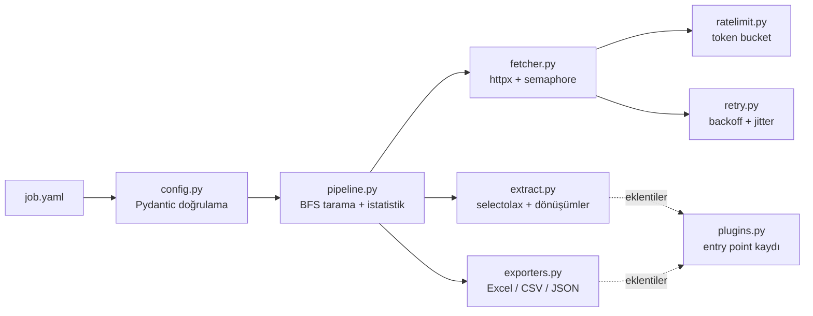

# Harvester

[English](README.md) | **Türkçe**

[](https://github.com/VertexSoftwareDev/harvester/actions/workflows/ci.yml)


**Bildirimsel, async web scraping. Çekmek istediğin veriyi YAML ile tarif et, temiz bir Excel, CSV veya JSON dosyası al.**

```yaml
# examples/books.yaml
start_urls: [https://books.toscrape.com/catalogue/page-1.html]
item: article.product_pod
fields:
  title: h3 a @title
  price: p.price_color | price
  rating: p.star-rating @class | regex:star-rating (\w+) | lower
  url: h3 a @href | absolute_url
pagination:
  next: li.next a
  max_pages: 5
exports:
  - format: excel
```

```console
$ harvester run examples/books.yaml
Job 'books' finished
 Pages     5 ok, 0 failed
 Items     100 scraped, 0 skipped
 Elapsed   2.41s
 Output    output/books-2026-09-17.xlsx
 Output    output/books.csv
```

## Neden Harvester?

Scraping betiklerinin çoğu kopyala-yapıştır ile yazılmış tek kullanımlık kodlardır.
Yeniden deneme ve hız sınırı yoktur, bir sonraki işte tekrar kullanılamazlar.
Harvester, **neyin** çekileceğini (küçük bir YAML dosyası) verinin **nasıl** düzgünce
çekileceğinden (test edilmiş bir async motor) ayırır:

- **Async ve siteye saygılı:** `httpx` ile eşzamanlı istekler, token bucket hız
  sınırlayıcı, zaman aşımı, `429` ve `5xx` hatalarında üstel bekleme ve jitter ile
  yeniden deneme.
- **Bildirimsel:** CSS seçiciler, HTML nitelikleri ve zincirlenebilen dönüşümler
  (`price`, `int`, `absolute_url`, `regex:...` gibi). Çoğu site için kod yazmak gerekmez.
- **Baştan doğrulama:** İş dosyaları katı ve değiştirilemez Pydantic modellerine
  dönüştürülür. Yazım hatalarında yol gösteren mesajlar çıkar
  (`Unknown transform 'prise'. Did you mean 'price'?`).
- **İşe hazır çıktı:** Başlıkları biçimlendirilmiş, filtrelenebilir ve linkleri
  tıklanabilir Excel; Excel'de Türkçe karakterleri bozmayan CSV (UTF-8 BOM); JSON ve JSON Lines.
- **Eklentilerle genişletilebilir:** Kendi paketinden entry point ile yeni çıktı
  formatları veya dönüşümler ekleyebilirsin.
- **Sağlam mühendislik:** `mypy --strict`, `ruff` ve internete hiç çıkmayan hızlı bir
  test paketi. CI, Linux ve Windows'ta çalışır.

## Kurulum

```bash
pip install pyharvester            # PyPI'da yayınlandığında
# veya kaynak koddan
git clone https://github.com/VertexSoftwareDev/harvester && cd harvester
uv sync
```

## Hızlı test

Her şeyin çalıştığını yaklaşık bir dakikada kontrol et. [uv](https://docs.astral.sh/uv/)
ve Git yeterli; uv uygun Python sürümünü kendisi kurar.

```bash
git clone https://github.com/VertexSoftwareDev/harvester
cd harvester
uv sync                                                  # bağımlılıkları kur
uv run harvester --version                               # komut satırı aracı kuruldu mu
uv run pytest -q                                         # tüm testler, internet gerekmez
uv run harvester validate examples/books.yaml            # iş dosyasını kontrol et, istek atılmaz
uv run harvester run examples/books.yaml --max-pages 1 -e csv   # canlı çalıştırma: 20 kitap -> output/books.csv
```

uv olmadan, sadece pip ile (Python 3.12 ve üstü):

```bash
python -m venv .venv
source .venv/bin/activate          # Windows: .venv\Scripts\activate
pip install -e .
harvester run examples/quotes.yaml --max-pages 1 -e json   # 10 alıntı -> output/quotes.json
```

> `uv` sertifika hatası verirse (antivirüs veya şirket proxy'si arkasında sık görülür)
> komuta `--system-certs` ekle, örneğin `uv sync --system-certs`
> (eski uv sürümlerinde `--native-tls`).

## Kullanım

```bash
harvester validate examples/books.yaml                 # işi kontrol et, istek atılmaz
harvester run examples/books.yaml                      # tara ve dışa aktar
harvester run examples/quotes.yaml -e excel -e csv:quotes.csv -o data --max-pages 2
harvester plugins                                      # çıktı formatlarını ve dönüşümleri listele
harvester -v run examples/books.yaml                   # ilerleme kayıtlarıyla
```

Kütüphane olarak:

```python
import asyncio
from harvester import Crawler, load_job


async def main() -> None:
    crawler = Crawler(load_job("examples/books.yaml"))
    async for item in crawler.crawl():
        print(item["title"], item["price"])
    print(crawler.stats)


asyncio.run(main())
```

Docker ile:

```bash
docker build -t harvester .
docker run --rm -v "$PWD/output:/app/output" harvester run examples/books.yaml
```

## İş dosyası başvurusu

| Anahtar | Açıklama |
| --- | --- |
| `name` | İşin adı, çıktı dosya adlarında kullanılır. Varsayılanı dosya adıdır. |
| `start_urls` | Başlangıç adresleri (bir veya daha fazla). |
| `item` | **Her kayıt için bir elemanı** seçen CSS seçici. |
| `fields` | Alan adı ile alan tanımının eşleşmesi (aşağıya bak). |
| `pagination.next` | "Sonraki sayfa" linkinin CSS seçicisi. |
| `pagination.max_pages` | Toplam sayfa sınırı (varsayılan `10`). |
| `http.concurrency` | Aynı anda yapılan istek sayısı (varsayılan `5`). |
| `http.rate_limit` | Saniyedeki istek sayısı; kapatmak için `null` (varsayılan `2`). |
| `http.retries` | İstek başına deneme sayısı (varsayılan `3`). |
| `http.backoff` | Yeniden denemeler arasındaki temel bekleme, saniye (varsayılan `0.5`). |
| `http.timeout`, `http.headers` | İstek zaman aşımı ve başlıkları. |
| `exports[].format` | `excel`, `csv`, `json`, `jsonl` veya bir eklenti. |
| `exports[].path` | Dosya adı şablonu. `{name}`, `{date}` ve `{timestamp}` desteklenir. |

### Alan tanımları

Bir alan kısa biçimde yazılabilir: `"<seçici> [@nitelik] [| dönüşüm ...]"`

```yaml
title: h3 a                      # elemanın metni
link: h3 a @href | absolute_url  # nitelik + dönüşüm
```

Ya da uzun biçimde:

```yaml
tags:
  selector: a.tag
  many: true          # tüm eşleşmeleri liste olarak al
author:
  selector: small.author
  required: true      # bu alan boşsa kaydı atla
  transforms: [strip, upper]
```

### Hazır dönüşümler

| Dönüşüm | Örnek |
| --- | --- |
| `strip` | `"  In \n stock "` → `"In stock"` |
| `lower` / `upper` | harfleri küçültür / büyütür |
| `price` / `float` | `"£1,234.50"` ve `"1.234,50 TL"` → `1234.5` |
| `int` | `"In stock (22 available)"` → `22` |
| `absolute_url` | `"../book.html"` → `"https://site/book.html"` |
| `regex:DESEN` | ilk yakalama grubunu, grup yoksa eşleşmenin tamamını döndürür |

## Genişletme

Kendi paketinde bir dönüşüm veya çıktı formatı yaz:

```python
# my_package/plugins.py
from pathlib import Path
from typing import ClassVar


class ParquetExporter:
    """Analiz için sütun tabanlı çıktı."""

    extension: ClassVar[str] = "parquet"

    def export(self, items, path: Path) -> None:
        import pandas as pd

        pd.DataFrame(items).to_parquet(path)
```

Sonra entry point ile kaydet:

```toml
[project.entry-points."harvester.exporters"]
parquet = "my_package.plugins:ParquetExporter"
```

Artık her iş dosyasında `format: parquet` kullanılabilir.

## Mimari



## Geliştirme

```bash
uv sync
uv run pytest --cov           # testler (internet erişimi yok)
uv run ruff check . && uv run ruff format --check .
uv run mypy                   # katı tip kontrolü
```

## Yol haritası

- [ ] Detay sayfalarını takip etme (bir linke `follow:` ile girip alanlarını kayda ekleme)
- [ ] JavaScript ağırlıklı siteler için Playwright desteği
- [ ] Zamanlama (`--every 6h`) ve Telegram/Slack bildirimleri
- [ ] Google Sheets ve PostgreSQL çıktıları
- [ ] Dağınık sayfalar için yapay zekâ destekli veri çekme
- [ ] Çalışma geçmişi için küçük bir FastAPI paneli

## Sorumlu kullanım

Sadece erişim iznin olan verileri çek. Her sitenin kullanım koşullarına ve
`robots.txt` dosyasına uy, hız sınırlarını düşük tut. Örnekler, pratik yapmak için
kurulmuş [toscrape.com](https://toscrape.com) sitelerini kullanır.

## Lisans

MIT
